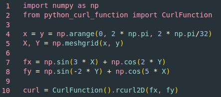

# Python-Curl-Function
An extension to numpy using discrete fourier transforms to compute the curl of 2D and 3D functions. This produces results far more accurate than using 10th-order finite difference derivatives (*which is as far as I tested*).

## Main Functions
```curl2D``` computes the curl for a 2D input function $\boldsymbol{F} = (F_x, F_y)$.

```curl3D``` computes the curl for a 3D input function $\boldsymbol{F} = (F_x, F_y, F_z)$.

```rcurl2D``` computes the curl for a 2D purely real input function $\boldsymbol{F} = (F_x, F_y)$.

```rcurl3D``` computes the curl for a 3D purely real input function $\boldsymbol{F} = (F_x, F_y, F_z)$.

## Download
You can download it simply with the download button, or using 

```
wget https://raw.githubusercontent.com/morgannamaths/Python-Curl-Function/main/python_curl_function.py
```

in the terminal.

## Usage
Download the ```python_curl_function.py``` file and store it in the same file as your project (or wherever, really), and import it into your code using ```from python_curl_function import CurlFunction```.



## Explanation
Mathematically, the curl $\nabla \times \boldsymbol{F}$ can be written as

$`\begin{vmatrix}
     \hat{i} & \hat{j} & \hat{k}\\ 
     \frac{\partial}{\partial x} & \frac{\partial}{\partial y} & \frac{\partial}{\partial z}\\
     F_x(x, y, z) & F_y(x, y, z) & F_z(x, y, z)
\end{vmatrix}`$

which can be further expanded to

$= \left( \frac{\partial F_z}{\partial y} - \frac{\partial F_y}{\partial z} \right)\hat{i} + \left( \frac{\partial F_x}{\partial z} - \frac{\partial F_z}{\partial x} \right)\hat{j} + \left( \frac{\partial F_y}{\partial x} - \frac{\partial F_x}{\partial y} \right)\hat{k}$

Clearly, there are 6 derivatives (2 in the 2D case) required to compute. This code utilises the discrete fourier transform to compute these, which (based on testing) are more accurate than at least 10th-order finite difference derivatives, at the cost of being more computationally expensive.

$\hat{f}(\vec{k}) = \frac{1}{N} \Sigma_{m = 0}^{N-1} f(\vec{x})$ $e^{-i\vec{k} \bullet \vec{x}_m}$

$f(\vec{x}) = \Sigma_{k = -N/2 + 1}^{N/2} \hat{f}(\vec{k})$ $e^{i\vec{k} \bullet \vec{x}_m}$

where $\vec{x}_m$ = $\frac{2 \pi m}{N}$

## Further Optimisation
For real functions, you can instead use ```rcurl2D``` and ```rcurl3D``` to perform a real discrete fourier transform. This is because the discrete fourier transform of a real function is Hermitian-symmetric and thus we can discard half of the transformed values to save on memory and computation.
